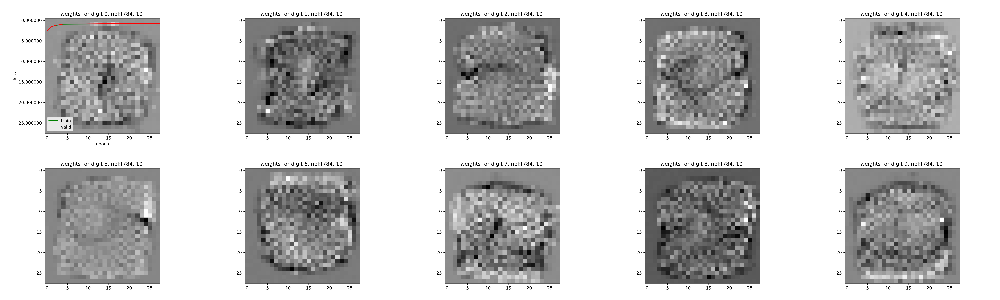
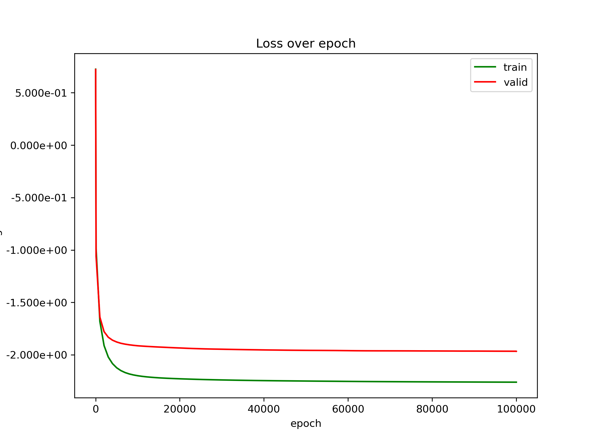
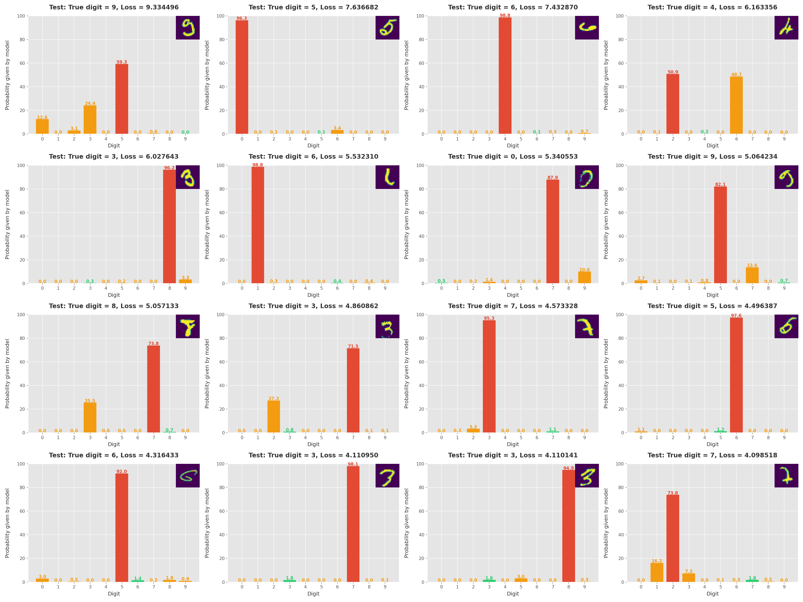
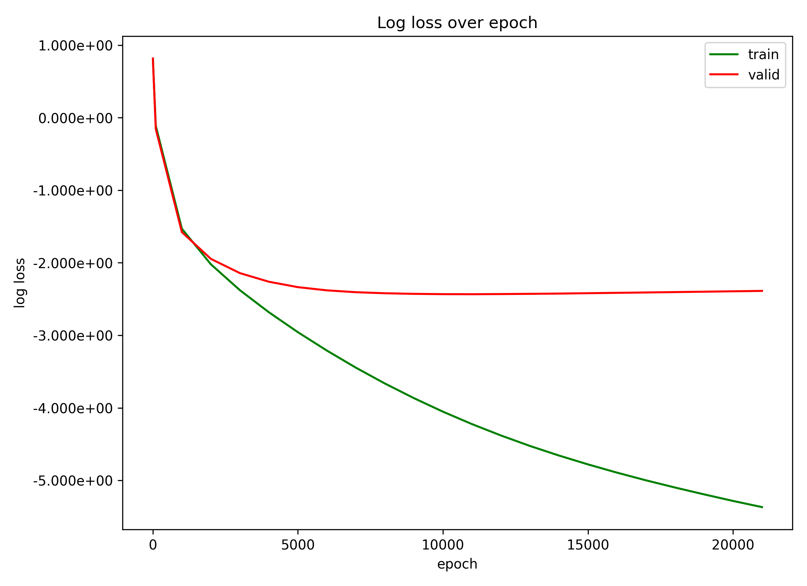
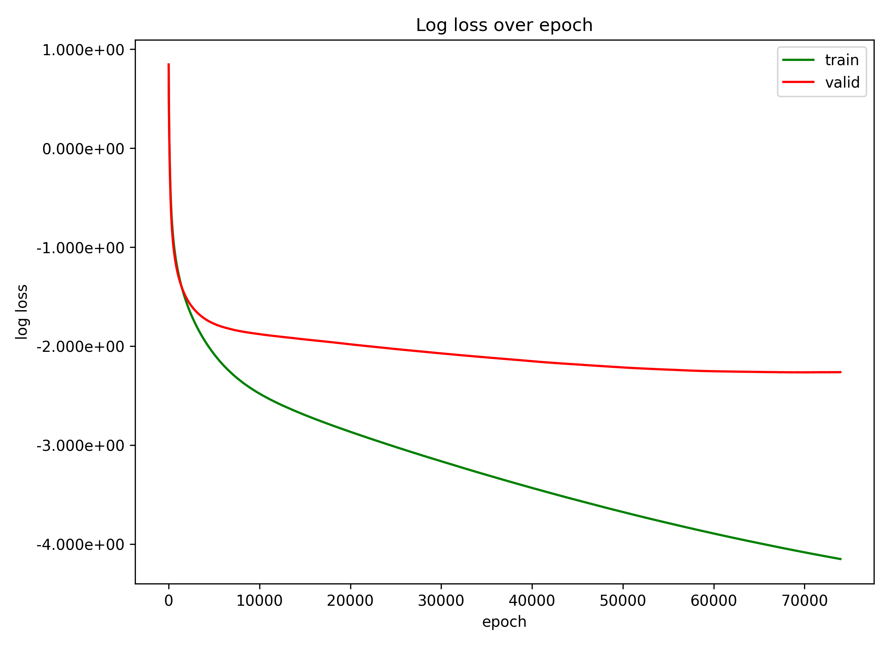
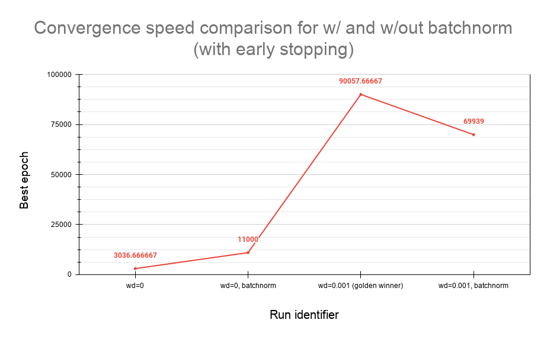

# Lab 1 notes (ušporko)

Excel sheet with some results:
<https://docs.google.com/spreadsheets/d/1fv7UyF2UmWiX7Lin4GtoRyjfZfZsXrGy9lFEeq9bXfQ/edit#gid=0>

## 3 - pt_linreg

Experiment setup:

```py
Hyperparameters
epochs = 500
eta = 0.1

## Definition of the computational graph
# data and parameters, init of parameters
a = torch.randn(1, requires_grad=True)
b = torch.randn(1, requires_grad=True)

X = torch.tensor([1, 2, 3, 4, 3.5])
Y = torch.tensor([3, 5, 7, 9, 7.9])
N = X.shape[0]

# optimization procedure: gradient descent
optimizer = optim.SGD([a, b], lr=eta)
```

Result:

```js
step: 000000
        loss:7.771786e+01
        Y_:[-1.5415423 -1.8580694 -2.1745963 -2.4911234 -2.33286  ]
        a:[4.785912]
        b:[0.46691245]
        pytorch gradients:
                a:tensor([-51.0244])
                b:tensor([-16.9193])
        gradients by ma hand:
                a:-51.024391174316406
                b:-16.91927719116211
step: 000001
        loss:5.821820e+01
        Y_:[ 5.2528243 10.038736  14.824649  19.610561  17.217606 ]
        a:[0.3515877]
        b:[-0.9348627]
        pytorch gradients:
                a:tensor([44.3432])
                b:tensor([14.0178])
        gradients by ma hand:
                a:44.34324264526367
                b:14.01775074005127
step: 000002
        loss:4.362144e+01
        Y_:[-0.58327496 -0.23168725  0.11990041  0.47148818  0.2956943 ]
        a:[4.1682305]
        b:[0.3382525]
        pytorch gradients:
                a:tensor([-38.1664])
                b:tensor([-12.7312])
        gradients by ma hand:
                a:-38.16642379760742
                b:-12.731152534484863
step: 000003
        loss:3.269430e+01
        Y_:[ 4.506483  8.674713 12.842944 17.011175 14.927059]
        a:[0.8472642]
        b:[-0.70424247]
        pytorch gradients:
                a:tensor([33.2097])
                b:tensor([10.4249])
        gradients by ma hand:
                a:33.209659576416016
                b:10.42495059967041
step: 000004
        loss:2.451377e+01
        Y_:[0.1430217 0.9902859 1.8375499 2.6848142 2.261182 ]
        a:[3.7016785]
        b:[0.25508344]
        pytorch gradients:
                a:tensor([-28.5441])
                b:tensor([-9.5933])
        gradients by ma hand:
                a:-28.544147491455078
                b:-9.59325885772705
step: 000005
        loss:1.838900e+01
        Y_:[ 3.9567618  7.6584406 11.360119  15.061797  13.210958 ]
        a:[1.2140968]
        b:[-0.51883966]
        pytorch gradients:
                a:tensor([24.8758])
                b:tensor([7.7392])
        gradients by ma hand:
                a:24.875816345214844
                b:7.739230155944824
step: 000006
        loss:1.380295e+01
        Y_:[0.6952571 1.909354  3.1234508 4.3375473 3.730499 ]
        a:[3.3484466]
        b:[0.20531602]
        pytorch gradients:
                a:tensor([-21.3435])
                b:tensor([-7.2416])
        gradients by ma hand:
                a:-21.3435001373291
                b:-7.241556644439697
step: 000007
        loss:1.036864e+01
        Y_:[ 3.5537627  6.9022093 10.250655  13.599102  11.924879 ]
        a:[1.4847013]
        b:[-0.36790833]
        pytorch gradients:
                a:tensor([18.6375])
                b:tensor([5.7322])
        gradients by ma hand:
                a:18.637453079223633
                b:5.732243537902832
step: 000008
        loss:7.796427e+00
        Y_:[1.1167929 2.6014943 4.0861955 5.5708966 4.828546 ]
        a:[3.0802267]
        b:[0.17993467]
        pytorch gradients:
                a:tensor([-15.9553])
                b:tensor([-5.4784])
        gradients by ma hand:
                a:-15.955255508422852
                b:-5.478430271148682
step: 000009
        loss:5.869528e+00
        Y_:[ 3.2601614  6.340388   9.420614  12.500841  10.960728 ]
        a:[1.683479]
        b:[-0.24337466]
        pytorch gradients:
                a:tensor([13.9675])
                b:tensor([4.2331])
        gradients by ma hand:
                a:13.967475891113281
                b:4.233092784881592
step: 000010
        loss:4.425694e+00
        Y_:[1.4401042 3.1235833 4.807062  6.490541  5.6488013]
        a:[2.8758218]
        b:[0.17222165]
        pytorch gradients:
                a:tensor([-11.9234])
                b:tensor([-4.1560])
        gradients by ma hand:
                a:-11.923429489135742
                b:-4.155962944030762
step: 000011
        loss:3.343483e+00
        Y_:[ 3.0480435  5.9238653  8.799686  11.6755085 10.237597 ]
        a:[1.8286834]
        b:[-0.13916643]
        pytorch gradients:
                a:tensor([10.4714])
                b:tensor([3.1139])
        gradients by ma hand:
                a:10.471384048461914
                b:3.1138806343078613
step: 000012
        loss:2.532006e+00
        Y_:[1.6895169 3.5182004 5.346884  7.175567  6.261225 ]
        a:[2.7193584]
        b:[0.17717783]
        pytorch gradients:
                a:tensor([-8.9067])
                b:tensor([-3.1634])
        gradients by ma hand:
                a:-8.906749725341797
                b:-3.163442611694336
step: 000013
        loss:1.923228e+00
        Y_:[ 2.8965364  5.615895   8.335253  11.054611   9.694932 ]
        a:[1.9339669]
        b:[-0.05071126]
        pytorch gradients:
                a:tensor([7.8539])
                b:tensor([2.2789])
        gradients by ma hand:
                a:7.853916168212891
                b:2.27889084815979
step: 000014
        loss:1.466227e+00
        Y_:[1.8832556 3.8172226 5.7511897 7.6851563 6.718173 ]
        a:[2.5989468]
        b:[0.19108887]
        pytorch gradients:
                a:tensor([-6.6498])
                b:tensor([-2.4180])
        gradients by ma hand:
                a:-6.6498003005981445
                b:-2.418001174926758
step: 000015
        loss:1.122891e+00
        Y_:[ 2.7900357  5.3889823  7.9879293 10.586876   9.287402 ]
        a:[2.009539]
        b:[0.02543985]
        pytorch gradients:
                a:tensor([5.8941])
                b:tensor([1.6565])
        gradients by ma hand:
                a:5.894079685211182
                b:1.6564900875091553
step: 000016
        loss:8.646897e-01
        Y_:[2.0349786 4.0445175 6.0540566 8.063596  7.058826 ]
        a:[2.5056806]
        b:[0.21120088]
        pytorch gradients:
                a:tensor([-4.9614])
                b:tensor([-1.8576])
        gradients by ma hand:
                a:-4.961417198181152
                b:-1.8576103448867798
step: 000017
        loss:6.702665e-01
        Y_:[ 2.7168815  5.222562   7.7282424 10.233923   8.981083 ]
        a:[2.063032]
        b:[0.09189322]
        pytorch gradients:
                a:tensor([4.4265])
                b:tensor([1.1931])
        gradients by ma hand:
                a:4.426485538482666
                b:1.1930766105651855
step: 000018
        loss:5.236359e-01
        Y_:[2.154925  4.217957  6.2809887 8.344021  7.312505 ]
        a:[2.4328856]
        b:[0.23547737]
        pytorch gradients:
                a:tensor([-3.6985])
                b:tensor([-1.4358])
        gradients by ma hand:
                a:-3.698538303375244
                b:-1.43584144115448
step: 000019
        loss:4.128285e-01
        Y_:[2.668363  5.1012487 7.5341344 9.96702   8.750577 ]
        a:[2.100151]
        b:[0.15062365]
        pytorch gradients:
                a:tensor([3.3273])
                b:tensor([0.8485])
        gradients by ma hand:
                a:3.327345371246338
                b:0.848537266254425
step: 000020
        loss:3.288857e-01
        Y_:[2.2507746 4.350926  6.451077  8.551228  7.5011525]
        a:[2.375559]
        b:[0.26241735]
        pytorch gradients:
                a:tensor([-2.7541])
                b:tensor([-1.1179])
        gradients by ma hand:
                a:-2.7540793418884277
                b:-1.1179369688034058
step: 000050
        loss:2.168721e-02
        Y_:[2.741402  4.8501744 6.9589467 9.0677185 8.013332 ]
        a:[2.109327]
        b:[0.64336675]
        pytorch gradients:
                a:tensor([-0.0055])
                b:tensor([-0.1074])
        gradients by ma hand:
                a:-0.0055488585494458675
                b:-0.10737047344446182
step: 000100
        loss:3.011330e-03
        Y_:[2.9298239 4.9513645 6.972905  8.994446  7.9836755]
        a:[2.020664]
        b:[0.9109945]
        pytorch gradients:
                a:tensor([0.0088])
                b:tensor([-0.0271])
        gradients by ma hand:
                a:0.00876617431640625
                b:-0.027114104479551315
step: 000150
        loss:1.510718e-03
        Y_:[2.982557  4.9787908 6.975024  8.971258  7.973141 ]
        a:[1.9959842]
        b:[0.9870925]
        pytorch gradients:
                a:tensor([0.0025])
                b:tensor([-0.0077])
        gradients by ma hand:
                a:0.0024950981605798006
                b:-0.007691478822380304
step: 000200
        loss:1.389896e-03
        Y_:[2.9975202 4.9865723 6.9756246 8.964677  7.970151 ]
        a:[1.9889812]
        b:[1.0086862]
        pytorch gradients:
                a:tensor([0.0007])
                b:tensor([-0.0022])
        gradients by ma hand:
                a:0.00070953369140625
                b:-0.002182102296501398
step: 000250
        loss:1.380160e-03
        Y_:[3.0017662 4.9887805 6.975795  8.962809  7.9693017]
        a:[1.9869943]
        b:[1.0148138]
        pytorch gradients:
                a:tensor([0.0002])
                b:tensor([-0.0006])
        gradients by ma hand:
                a:0.0002006530703511089
                b:-0.0006193161243572831
step: 000300
        loss:1.379369e-03
        Y_:[3.002971 4.989407 6.975843 8.962279 7.969061]
        a:[1.9864303]
        b:[1.0165524]
        pytorch gradients:
                a:tensor([5.7604e-05])
                b:tensor([-0.0002])
        gradients by ma hand:
                a:5.760193016612902e-05
                b:-0.00017557144747115672
step: 000350
        loss:1.379322e-03
        Y_:[3.003313  4.989585  6.9758573 8.962129  7.968993 ]
        a:[1.9862702]
        b:[1.017046]
        pytorch gradients:
                a:tensor([1.8030e-05])
                b:tensor([-4.9210e-05])
        gradients by ma hand:
                a:1.8024444216280244e-05
                b:-4.920959327137098e-05
step: 000400
        loss:1.379319e-03
        Y_:[3.0034099 4.9896355 6.9758606 8.962087  7.968974 ]
        a:[1.9862248]
        b:[1.0171858]
        pytorch gradients:
                a:tensor([7.3537e-06])
                b:tensor([-1.3351e-05])
        gradients by ma hand:
                a:7.343292054429185e-06
                b:-1.33514404296875e-05
step: 000450
        loss:1.379314e-03
        Y_:[3.0034375 4.98965   6.975862  8.962074  7.9689684]
        a:[1.9862119]
        b:[1.0172255]
        pytorch gradients:
                a:tensor([3.7141e-06])
                b:tensor([-3.2429e-06])
        gradients by ma hand:
                a:3.719329924933845e-06
                b:-3.24249276673072e-06
Done
```

## 4 - pt_logreg

logreg vs pt_logreg - 1 - no weight decay - same


logreg vs pt_logreg - 2 - with weight decay - not same cause initial pt version applied L2 to bias


logreg vs pt_logreg - 3 - with weight decay - same


pt_logreg eta=0.1 lambda=1 epochs=30000 --- too much regularization


pt_logreg eta=10 lambda=0 epochs=30000 --- eta too high, divergence


## 5 - pt_deep - shallow vs deep - relu vs sigmoid

Napisao sam PTDeep i PTDeep2, prvi je "na ruke" dok potonji koristi gotove PyTorch funkcionalnosti (torch.nn.Linear, torch.nn.Sequential). Jedina je razlika između njih što PTDeep2 koristi kaiming_uniform_ za inicijalizaciju parametara težina i pristranosti, dok PTDeep koristi inicijalizira težine sa N(0,1), a pristranosti sa nulama. Nakon što sam podesio da se i PTDeep2 inicijalizira na isti način kao i PTDeep, davali su identične rezultate na MNIST skupu podataka. Primjetio sam da je PTDeep2 mjerljivo brži od PTDeep i da uz kaiming_uniform_ inicijalizaciju daje brže bolje rezultate.

### Stats

Parametri su isti za sve. "Hidden layers" govori koji je od ovih:
0 --> [D,C]
1 --> [D,10,C]
2 --> [D,10,20,C]

A datasetovi su ovi:
```py
    ...
    np.random.seed(100)
    ...

    @staticmethod
    def load_dataset(id):
        if id == 1:
            return sample_gauss_2d(3, 100)
        elif id == 2:
            return sample_gmm_2d(4, 2, 40)
        elif id == 3:
            return sample_gmm_2d(6, 2, 10)
        else:
            raise RuntimeError(f"Dataset with id {id} is not supported")
```

#### RELU


#### SIGMOID


Tko je bio bolji? Za ove parametre, ReLU je imao bolje rezultate na sva tri dataseta. Probao sam i bez whiteninga za sigmoidu na zadnjem datasetu, ali je ReLU i dalje bolji. Mislim da je to do datasetova i toga da se na ovim datasetovima ReLu uspio bolje prenaučiti.

TODO Uputa kaze: "Sigmoida bi za ovakve male probleme zbog neprekidnosti trebala postići bolje rezultate od zglobnice" Nisam dobio takve rezultate.

Da se primjetiti da bez hidden layera nije bitna funkcija aktivacije, sto je ocekivano.

### Decision boundaries

#### RELU


#### SIGMOID


Moze se na granicama primjetiti je li ReLU ili je Sigmoida koristena. ReLU je linearan po dijelovima, sigmoida ima krivulje

### Svi rezultati

#### ReLU

```js
1
'(recall_i, precision_i)': [(0.97,
                              0.9603960396039604),
                             (0.96,
                              0.9795918367346939),
                             (1.0,
                              0.9900990099009901)],
 'accuracy': 0.9766666666666667,
 'confusion matrix': array([[ 97,   2,   1],
       [  4,  96,   0],
       [  0,   0, 100]]),
 'train_loss': tensor(0.0824, dtype=torch.float64, grad_fn=<AddBackward0>)
2
'(recall_i, precision_i)': [(0.98,
                              0.9702970297029703),
                             (0.97,
                              0.9797979797979798),
                             (1.0, 1.0)],
 'accuracy': 0.9833333333333333,
 'confusion matrix': array([[ 98,   2,   0],
       [  3,  97,   0],
       [  0,   0, 100]]),
 'train_loss': tensor(0.0514, dtype=torch.float64, grad_fn=<AddBackward0>)
3
'(recall_i, precision_i)': [(0.99,
                              0.99),
                             (0.99,
                              0.99),
                             (1.0, 1.0)],
 'accuracy': 0.9933333333333333,
 'confusion matrix': array([[ 99,   1,   0],
       [  1,  99,   0],
       [  0,   0, 100]]),
 'train_loss': tensor(0.0235, dtype=torch.float64, grad_fn=<AddBackward0>)
4
'(recall_i, precision_i)': [(0.5875,
                              0.7121212121212122),
                             (0.7625,
                              0.648936170212766)],
 'accuracy': 0.675,
 'confusion matrix': array([[47, 33],
       [19, 61]]),
 'train_loss': tensor(0.4415, dtype=torch.float64, grad_fn=<AddBackward0>)
5
'(recall_i, precision_i)': [(0.9625,
                              0.9625),
                             (0.9625,
                              0.9625)],
 'accuracy': 0.9625,
 'confusion matrix': array([[77,  3],
       [ 3, 77]]),
 'train_loss': tensor(0.1277, dtype=torch.float64, grad_fn=<AddBackward0>)
6
'(recall_i, precision_i)': [(0.9875,
                              0.9634146341463414),
                             (0.9625,
                              0.9871794871794872)],
 'accuracy': 0.975,
 'confusion matrix': array([[79,  1],
       [ 3, 77]]),
 'train_loss': tensor(0.1032, dtype=torch.float64, grad_fn=<AddBackward0>)
7
'(recall_i, precision_i)': [(0.5666666666666667,
                              0.6071428571428571),
                             (0.6333333333333333,
                              0.59375)],
 'accuracy': 0.6,
 'confusion matrix': array([[17, 13],
       [11, 19]]),
 'train_loss': tensor(0.6682, dtype=torch.float64, grad_fn=<AddBackward0>)
8
'(recall_i, precision_i)': [(1.0,
                              0.967741935483871),
                             (0.9666666666666667,
                              1.0)],
 'accuracy': 0.9833333333333333,
 'confusion matrix': array([[30,  0],
       [ 1, 29]]),
 'train_loss': tensor(0.1020, dtype=torch.float64, grad_fn=<AddBackward0>)
9
'(recall_i, precision_i)': [(1.0, 1.0),
                             (1.0, 1.0)],
 'accuracy': 1.0,
 'confusion matrix': array([[30,  0],
       [ 0, 30]]),
 'train_loss': tensor(0.0246, dtype=torch.float64, grad_fn=<AddBackward0>)
```

#### Sigmoid

```js
1
'(recall_i, precision_i)': [(0.97,
                              0.9603960396039604),
                             (0.96,
                              0.9795918367346939),
                             (1.0,
                              0.9900990099009901)],
 'accuracy': 0.9766666666666667,
 'confusion matrix': array([[ 97,   2,   1],
       [  4,  96,   0],
       [  0,   0, 100]]),
 'train_loss': tensor(0.0824, dtype=torch.float64, grad_fn=<AddBackward0>)
2
'(recall_i, precision_i)': [(0.98,
                              0.9607843137254902),
                             (0.96,
                              0.9896907216494846),
                             (1.0,
                              0.9900990099009901)],
 'accuracy': 0.98,
 'confusion matrix': array([[ 98,   1,   1],
       [  4,  96,   0],
       [  0,   0, 100]]),
 'train_loss': tensor(0.0778, dtype=torch.float64, grad_fn=<AddBackward0>)
3
'(recall_i, precision_i)': [(0.99,
                              0.9705882352941176),
                             (0.97,
                              0.9897959183673469),
                             (1.0, 1.0)],
 'accuracy': 0.9866666666666667,
 'confusion matrix': array([[ 99,   1,   0],
       [  3,  97,   0],
       [  0,   0, 100]]),
 'train_loss': tensor(0.0796, dtype=torch.float64, grad_fn=<AddBackward0>)
4
'(recall_i, precision_i)': [(0.5875,
                              0.7121212121212122),
                             (0.7625,
                              0.648936170212766)],
 'accuracy': 0.675,
 'confusion matrix': array([[47, 33],
       [19, 61]]),
 'train_loss': tensor(0.4415, dtype=torch.float64, grad_fn=<AddBackward0>)
5
'(recall_i, precision_i)': [(0.9625,
                              0.927710843373494),
                             (0.925,
                              0.961038961038961)],
 'accuracy': 0.94375,
 'confusion matrix': array([[77,  3],
       [ 6, 74]]),
 'train_loss': tensor(0.1766, dtype=torch.float64, grad_fn=<AddBackward0>)
6
'(recall_i, precision_i)': [(0.9625,
                              0.9390243902439024),
                             (0.9375,
                              0.9615384615384616)],
 'accuracy': 0.95,
 'confusion matrix': array([[77,  3],
       [ 5, 75]]),
 'train_loss': tensor(0.1612, dtype=torch.float64, grad_fn=<AddBackward0>)
7
'(recall_i, precision_i)': [(0.5666666666666667,
                              0.6071428571428571),
                             (0.6333333333333333,
                              0.59375)],
 'accuracy': 0.6,
 'confusion matrix': array([[17, 13],
       [11, 19]]),
 'train_loss': tensor(0.6682, dtype=torch.float64, grad_fn=<AddBackward0>)
8
'(recall_i, precision_i)': [(1.0,
                              0.967741935483871),
                             (0.9666666666666667,
                              1.0)],
 'accuracy': 0.9833333333333333,
 'confusion matrix': array([[30,  0],
       [ 1, 29]]),
 'train_loss': tensor(0.1745, dtype=torch.float64, grad_fn=<AddBackward0>)
9
'(recall_i, precision_i)': [(1.0,
                              0.967741935483871),
                             (0.9666666666666667,
                              1.0)],
 'accuracy': 0.9833333333333333,
 'confusion matrix': array([[30,  0],
       [ 1, 29]]),
 'train_loss': tensor(0.1190, dtype=torch.float64, grad_fn=<AddBackward0>)
```

## 6 - ksvm_wrap

### Usporedite performansu modela koje implementiraju razredi PTDeep i KSVMWrap na većem broju slučajnih skupova podataka. Koje su prednosti i nedostatci njihovih funkcija gubitka? Koji od dvaju postupaka daje bolju garantiranu performansu? Koji od postupaka može primiti veći broj parametara? Koji bi od postupaka bio prikladniji za 2D podatke uzorkovane iz mješavine Gaussovi distribucija?

Pokrenuo sam na tri skupa podataka, na istim kao i prethodno pt_deep. Izabrani rezultati:


U skromnom broju eksperimenata koje sam pokrenuo i u kojima postoji samo skup za treniranje, ksvm_wrap i pt_deep su uspijevali postici podjednako visok accuracy (ali se na decizisjim plohama moze vidjeti da je za to kriva prenaucenost kojom nisam upravljao). pt_deep je postigao nizi gubitak mjeren kao nLL. Intuitivno je to jasno, pt_deep direktno minimizira takvu funkciju gubitka, dok svm gura podatke dalje od decizijske plohe.

Jedna prednost nLL kao funckije gubitka jest da se radi ML procjena koja ima probabilisticko objasnjenje. Jedan nedostatak ML procjene jest jednostavna prenaucenost, osobito u nedostatku podatka.

Jedna prednost SVMove funkcije gubitka koja maximizira udaljenost podataka od decizijske plohe jest mogucnost stvaranja intuitivnih i realisticnih decizijskih ploha, ako je skup podataka za to prikladan (nije prevelik i nema previse noisea). TODO jedan nedostatak :-)

Koji od dvaju postupaka daje bolju garantiranu performansu? No free lunch. Na testiranim skupovima s malo podataka je SVM mnogo brzi, a oboje su se uspjeli prenauciti. pt_deep je imao ocekivano nizi gubitak. Mislim da je na temelju eksperimenata hrabro zakljuciti vise od toga. Doduše, ako smijemo samo jedan model trenirati, SVM obećaje više za ovaj skup podataka jer je pt_deep osjetljiv na inicijalicaciju.

pt_deep je model koji moze imati proizvoljan broj parametara, odnosno proizvoljnu dubinu i sirinu, dok SVM ima nekolicinu hiperparametara poput 1. c 2. gamma 3. rbf/linear/poly 4.ovr vs ovo itd. SVM ne mijenja broj ucenih parametara kao pt_deep koji njima direktno upravlja pomocu hiperparametara (dubina i sirina svakog sloja).

Koji bi od postupaka bio prikladniji za 2D podatke uzorkovane iz mješavine Gaussovi distribucija? Mislim da je RBF SVM dao intuitivnije decizijske plohe od relu i sigmoid MLPova. Ali korišteni skupovi podatala nisu imali mnogo šuma pa je RBFu posao bio olakšan.

Pripadni grafovi rezultata su u nastavku.

#### Hard classification


#### Probability for most likely class


#### with whitening - worse results


## 7 - Studija slučaja: MNIST

### Za model konfiguracije [784, 10] iscrtajte i komentirajte naučene matrice težina za svaku pojedinu znamenku. Ponovite za različite iznose regularizacije

Sve konfiguracije imaju: activ=RELU, v=1, eta=0.1, early_stopping=1000 (or no early stopping)

Zanemarite crvene i plave linije na znamenakama 0, zaboravio sam jedan plt.close.

#### init=kaiming_uniform

weight decay = 1

weight decay = 1 (no early stopping!)

weight decay = 1e-1

weight decay = 1e-2

weight decay = 1e-3

weight decay = 1e-4

weight decay = 1e-4 (no early stopping!)

weight decay = 1e-5

weight decay = 0


#### init=normal

weight decay = 1

weight decay = 1e-3

weight decay = 1e-4

weight decay = 1e-5

weight decay = 0


#### init -- kaiming_uniform vs normal (jedno pored drugog)

weight decay = 1
normal

kaiming_uniform


Vrlo slicne. Razlike primjetim u tamnijoj/svjetlijoj pozadini kod na primjer znamenki 0 i 3.

#### Komentari

Moze se primjetiti da bez regularizacija naucene tezine ocigledno nauce sum. Uz vecu regularizaciju se sacuva ocekivani oblik znamenke.

### Naučite duboke modele s konfiguracijama [784, 10], [784, 100, 10], [784, 100, 100, 10] i [784, 100, 100, 100, 10]. Ako nemate funkcionalan GPU ne morate provoditi eksperimente s posljednje dvije konfiguracije. Nakon svake epohe učenja pohranite gubitak. Obratite pažnju na to da će dublji modeli bolje konvergirati s više iteracija s manjim korakom. Usporedite modele s obzirom na kretanje gubitka kroz epohe te pokazatelje performanse (točnost, preciznost, odziv) na skupovima za učenje i testiranje. Za najuspješniji model iscrtajte podatke koji najviše doprinose funkciji gubitka

U nastavku koristim kaiming_uniform (aka He initialization) koja se koristi i u nn.Linear jer dalje mnogo bolji inicijalni start od N(0,1). S N(0,1) sam susretao dosta nesretnih startnih pozicija koje bi (uz trenutni jednostavni postupak ucenja bez momentumama etc) ili lako zapinjale u lokalnim minimuma velikog gubitka ili dugo vremena trebale da pronadju dobro rjesenje.

Također, u svim eksperimentima koristim early stopping za izbor najboljeg modela. Prenaučene modele sam proučio u 4 podzadatku usporedbom performansi izgleda gubitka prilokom korištenja odnosno nekorištenja ranog zaustavljanja.

U nastavku su izabrani grafovi kretanja gubitka kroz epohe za različite arhitekture i različite jačine regularizacije.

#### [784, 10]

relu-normal-wd=0

***
relu-normal-wd=1e-3


#### [784, 100, 10]

relu_i=kaiming_uniform_h=3_epochs=10000_es=10000_eta=0.1_wd=0.0

***
relu_i=kaiming_uniform_h=3_epochs=10000_es=10000_eta=0.1_wd=0.0001

***
relu_i=kaiming_uniform_h=3_epochs=10000_es=10000_eta=0.1_wd=0.001

***
relu_i=kaiming_uniform_h=3_epochs=100000_es=1000_eta=0.1_wd=0.001

***
relu_i=kaiming_uniform_h=3_epochs=20000_es=20000_eta=0.1_wd=0.01

***
relu_i=kaiming_uniform_h=3_epochs=20000_es=20000_eta=0.1_wd=0.01


#### [784, 100, 100, 10]


relu_i=kaiming_uniform_h=4_epochs=100000_es=1000_eta=0.1_wd=0.0_s=360
/loss2_act=relu_i=kaiming_uniform_h=4_epochs=100000_es=1000_eta=0.1_wd=0.0_s=360.png)
***
relu_i=kaiming_uniform_h=4_epochs=100000_es=1000_eta=0.1_wd=0.001_s=72
/loss2_act=relu_i=kaiming_uniform_h=4_epochs=100000_es=1000_eta=0.1_wd=0.001_s=72.png)
***
relu_i=kaiming_uniform_h=4_epochs=100000_es=1000_eta=0.1_wd=0.01_s=72
/loss2_act=relu_i=kaiming_uniform_h=4_epochs=100000_es=1000_eta=0.1_wd=0.01_s=72.png)

#### [784, 100, 100, 100, 10]

Ovako izgleda funkcija gubitka kada je stopa učenja prevelika

relu_i=kaiming_uniform_h=5_epochs=100000_es=1000_eta=0.1_wd=0.0_s=192
/loss2_act=relu_i=kaiming_uniform_h=5_epochs=100000_es=1000_eta=0.1_wd=0.0_s=192.png)
***
relu_i=kaiming_uniform_h=5_epochs=100000_es=1000_eta=0.1_wd=0.0001_s=192
/loss2_act=relu_i=kaiming_uniform_h=5_epochs=100000_es=1000_eta=0.1_wd=0.0001_s=192.png)
***
relu_i=kaiming_uniform_h=5_epochs=100000_es=1000_eta=0.1_wd=0.01_s=360
/loss2_act=relu_i=kaiming_uniform_h=5_epochs=100000_es=1000_eta=0.1_wd=0.01_s=360.png)
***
relu_i=kaiming_uniform_h=5_epochs=100000_es=1000_eta=0.1_wd=0.01_s=72
/loss2_act=relu_i=kaiming_uniform_h=5_epochs=100000_es=1000_eta=0.1_wd=0.01_s=72.png)
***
relu_i=kaiming_uniform_h=5_epochs=100000_es=1000_eta=0.1_wd=0.001_s=192
/loss2_act=relu_i=kaiming_uniform_h=5_epochs=100000_es=1000_eta=0.1_wd=0.001_s=192.png)
***
relu_i=kaiming_uniform_h=5_epochs=100000_es=1000_eta=0.1_wd=0.001_s=360
/loss2_act=relu_i=kaiming_uniform_h=5_epochs=100000_es=1000_eta=0.1_wd=0.001_s=360.png)

Smanjenjem stope učenja i povećanjem broja maksimalnih epoha sam dobio sljedeće rezultate:

relu_i=kaiming_uniform_h=5_epochs=200000_es=1000_eta=0.01_wd=0.0

***relu_i=kaiming_uniform_h=5_epochs=200000_es=1000_eta=0.01_wd=0.0001

***relu_i=kaiming_uniform_h=5_epochs=200000_es=1000_eta=0.01_wd=0.001

***relu_i=kaiming_uniform_h=5_epochs=300000_es=2000_eta=0.03_wd=0.01


#### Usporedba modela s obzirom na funkcije gubitka

Na MNISTU, gubitak kroz epohe pada na skupu za učenje gotovo cijelo vrijeme kod svih modela (uz razumnu stopu učenja za koju ne dolazi do divergiranja i za koju model ne uči presporo). Ponašanje pogreške na skupu za validaciju ovisi o jačini regularizacije. Za jaču regularizaciju funkcija pogreške na skupu za treniranje i validaciju je bliža nego kada se regularizacija ne koristi.

#### Pokazatelji performanse (točnost, preciznost, odziv) na skupovima za učenje i testiranje

Arhitekture sam pokrenuo po 3 puta za svaku konfiguraciju (uz različite seedove / incijalne vrijednosti težina) da bih dobio mean i std (osim [784,10] koju sam pokrenuo samo jednom).

Pokazateljii performanse su prikazani za svaku arhitekturu odvojeno:

<!--  -->


U sljedećoj tablici i pripadnog grafu su vizualizirane test performance za sve konfiguracije. Najbolja konfiguracija je istaknuta.


Arhitektura [784,100,100,10] s wd=1e-3 je dala najbolju generalizacijsku performansu. Arhitekture s jednim skrivenim slojem više i manje od [784,100,100,10] daju također vrlo dobre rezultate.

Najuspješniji model: `python.exe -m demo.mlp.mnist_shootout --init kaiming_uniform --log_interval 1 --log_images_interval 400000 --v 1 --npl 784 100 100 10 --epochs 100000 --es 1000 --wd 1e-3 --eta 0.1 --seed 360`

Loss i acc za najuspješniji model:


#### Najteži podatci

Najteži po podskupovima:


4x4 gridovi najtežih podataka po podskupu:

Train:


Valid:


Test:


### Proučite utjecaj regularizacije na performansu dubokih modela na skupovima za učenje i testiranje

Na grafovima iz prethodnog podzadatka vidimo da razumna količina regulariacje pogoduje generalizaciji. Za naš skup podataka i ostale parametre su 1e-2 i 1e-3 među pogodnim vrijednostima za regularizaciju. Pretjerana regularizacija je onemogućila učenje i naškodila performansi modela (wd=0.1 i wd=1). Jasno je da je regularizacija hiperparametar.

#### Standardizacija ulaza kao oblik regularizacije

Svi eksperimenti su radili sa standardiziaranom verzijom MNISTa:
```py
class PTUtil:
      # ...
      @staticmethod
      def standardize_inplace(x_train, x_rest=[]):
            train_mean = x_train.mean()
            train_std = x_train.std()

            x_train.sub_(train_mean).div_(train_std)
            for x in x_rest:
                  x.sub_(train_mean).div_(train_std)

            return train_mean, train_std
      # ...

if params["whiten input"]:
      train_mean, train_std = PTUtil.standardize_inplace(x_train, [x_valid, x_test])
```

Nisam testirao koliki je utjecaj ovoga u poboljšanju generalizacijske sposbnosti mreže, nego sam podatke standardizirao sljedeći upute dobre prakse. Standardizacija bi trebala poboljšati uvijete za gradijenti spust i olakšati pronalazak boljeg minimuma, time poboljšavajući generalizacijske sposobnosti (stoga se naziva regularizacijom).

### Slučajno izdvojite 1/5 podataka iz skupa za učenje u skup za validaciju. Tijekom treniranja evaluirajte validacijsku performansu nakon završetka petlje po grupama podataka te na kraju vratite model s najboljom validacijskom performansom (engl. early stopping). Procijenite postignuti utjecaj na konačnu vrijednost funkcije cilja i generalizacijsku performansu

Implementirano rano zaustavljanje ce se prekinuti treniranje ako nakon X epoha validation_loss ne padne za barem Y (koristio sam X=1000 ili 2000 i Y=1e-7).

Pokrenuo sam najuspješniju arhitekturu uz wd=0 i wd=1e-3 i ostavio da izvrte 300k epoha do kraja, u nadi da će se prenaučiti:
`python.exe -m demo.mlp.mnist_shootout --init kaiming_uniform --log_interval 100 --log_images_interval 400000 --v 1 --npl 784 100 100 10 --epochs 300000 --es 1000000000 --wd 1e-3 --eta 0.1 --seed 360 --prefix force_`
`python.exe -m demo.mlp.mnist_shootout --init kaiming_uniform --log_interval 100 --log_images_interval 400000 --v 1 --npl 784 100 100 10 --epochs 300000 --es 1000000000 --wd 0 --eta 0.1 --seed 360 --prefix force_`

Dodatno:
`python.exe -m demo.mlp.mnist_shootout --init kaiming_uniform --log_interval 100 --log_images_interval 400000 --v 1 --npl 784 100 100 10 --epochs 300000 --es 1000000000 --wd 1e-3 --eta 0.1 --seed 72 --prefix force_`

Rezultati early stopping modela u usporedbi s modelom koji je odradio svih 300k epoha:

**wd=0.0**: Ovaj se model moze prenauciti i to se dogodilo sudeci po grafu funckije gubitka odnosno ponasanju validacijske funkcije gubitka (valid. funkcija gubitka raste dok na skupu za treniranje pada). U evaluaciji generalizacijskih sposobnosti na skupu za testiranje, to se odrazilo u duplo vecoj vrijednosti funkcije pogreske na prenaucenom modelu. Valja primjetiti da su, unatoc vecoj vrijednosti funkcije gubitka, u ovom eksperimentu tocnost i f1 mjera bolje u prenaucenom modelu. Ovo nisam ocekivao za prenauceni model.
<!-- i mislim da se moze opravdati time da je samo jedan eksperiment pokrenut, bez ikakve mjere drugog momenta i da bi temeljitije testiranje dalo bolje temelje za zakljucivanje. Takodjer, ovo moze biti uzrokovano implementiranom verzijom ranog zaustavljanja koja u obzir uzima samo loss na valid setu, ne i accuracy. -->
Update: Ponovio sam eksperiment s drugim seedom, ali pronašao isti trend: funkcija gubitka na prenaučenom modelu je duplo gora ali je točnost viša.

Log loss curve:


*Selected performance metrics:*
| metric | end/forced    | best/early_stopping |
|--------|------|-------|
| epochs | 300000 | **3100** |
| test_acc     | **0.9781** | 0.9747 |
| test_f1      | **0.9779** | 0.9744 |
| valid_acc    | **0.9768** | 0.9766 |
| train_acc    | **1.0** | 0.9962 |
| test_loss | 0.167346 | **0.081083** |
| train_loss| **0.000013** | 0.021577 |

All metrics:
*Early stopping:*

```js
{'best_epoch': 3100,
 'best_test_accuracy': 0.9747,
 'best_test_f1': 0.9744698355524429,
 'best_test_loss': 0.08108333142707712,
 'best_test_precision': 0.9745165826594324,
 'best_test_recall': 0.9744230929301125,
 'best_train_accuracy': 0.99624,
 'best_train_f1': 0.9962650926270269,
 'best_train_loss': 0.021577165637300905,
 'best_train_precision': 0.9962684886907056,
 'best_train_recall': 0.9962616965865008,
 'best_valid_accuracy': 0.9766,
 'best_valid_f1': 0.976384090824407,
 'best_valid_loss': 0.08056664346910276,
 'best_valid_precision': 0.9765197519388122,
 'best_valid_recall': 0.9762484673976811}
 ```

*Forced to do all epochs:

```js
{'end_test_accuracy': 0.9781,
 'end_test_f1': 0.9779084999998212,
 'end_test_loss': 0.1673462301429217,
 'end_test_precision': 0.9779277762105405,
 'end_test_recall': 0.9778892245490048,
 'end_train_accuracy': 1.0,
 'end_train_f1': 1.0,
 'end_train_loss': 1.3195074273106684e-05,
 'end_train_precision': 1.0,
 'end_train_recall': 1.0,
 'end_valid_accuracy': 0.9768,
 'end_valid_f1': 0.97659190576326,
 'end_valid_loss': 0.15827165365456036,
 'end_valid_precision': 0.9767867261015049,
 'end_valid_recall': 0.9763971631234412}
```

**wd=0.001**: Uz ovu količinu regularizacije, model se nije uspio prenaučiti. Perfomanse na skupu za testiranje su slične bez i s ranim zaustavljanjem.
*Log loss curve*


*Selected performance metrics:*
| metric | end/forced    | best/early_stopping |
|--------|------|-------|
| epochs | 300000 | **73705** |
| test_acc     | 0.9812 | **0.982** |
| test_f1      | 0.9811 | **0.9819** |
| vald_acc    | 0.9820 | 0.9820 |
| train_acc    | **0.9984** | 0.9983 |
| test_loss | **0.136502** | 0.138197 |
| train_loss| **0.095400** | 0.097330 |

All metrics:
*Early stopping:*

```js
{'best_epoch': 73705,
 'best_test_accuracy': 0.982,
 'best_test_f1': 0.9818980785122735,
 'best_test_loss': 0.13819733055148867,
 'best_test_precision': 0.9819536120021628,
 'best_test_recall': 0.9818425513033207,
 'best_train_accuracy': 0.99828,
 'best_train_f1': 0.9983037329038189,
 'best_train_loss': 0.09733061525997733,
 'best_train_precision': 0.998306631234309,
 'best_train_recall': 0.9983008345901577,
 'best_valid_accuracy': 0.982,
 'best_valid_f1': 0.9818685837335382,
 'best_valid_loss': 0.1393339890208909,
 'best_valid_precision': 0.9820158063010412,
 'best_valid_recall': 0.9817214053022607}
 ```

*Forced to do all epochs:*

```js
{'end_test_accuracy': 0.9812,
 'end_test_f1': 0.9810631342508451,
 'end_test_loss': 0.13650270435846934,
 'end_test_precision': 0.9811701762616923,
 'end_test_recall': 0.9809561155932192,
 'end_train_accuracy': 0.99844,
 'end_train_f1': 0.9984710406150795,
 'end_train_loss': 0.09540081636818312,
 'end_train_precision': 0.9984775505084004,
 'end_train_recall': 0.9984645308066444,
 'end_valid_accuracy': 0.982,
 'end_valid_f1': 0.9818671373890815,
 'end_valid_loss': 0.13699347088921496,
 'end_valid_precision': 0.9819635198923979,
 'end_valid_recall': 0.9817707738043401}
```

### Implementirajte stohastički gradijentni spust odnosno postupak učenja po minigrupama. Prije svake epohe izmiješajte podatke, zatim ih podijelite u n grupa (engl. mini-batch) i onda provedite korak učenja za svaku grupu posebno. Pripazite na to da gubitak karakterizirate tako da ne ovisi o veličini grupe jer je tako lakše interpretirati iznos gubitka te validirati korak učenja. Vaš kod pohranite u metodi train_mb. Procijenite utjecaj na kvalitetu konvergencije i postignutu performansu za najuspješniju konfiguraciju iz prethodnog zadatka. Napomena: u svrhu razumijevanja postupka učenja po mini-grupama, u ovoj vježbi nije dozvoljeno korištenje razreda torch.utils.data.DataLoader

Sav kod sam pohranio u metodu train (ne u train_mb) koja je parametrizirana parametrima params koji određuju kako će se odviti učenje.

Pokrenuo sam:
`python.exe -m demo.mlp.mnist_shootout --init kaiming_uniform --log_interval 1 --log_images_interval 400000 --v 1 --npl 784 100 100 10 --epochs 100000 --es 2000 --wd 1e-3 --eta 0.1 --seed 360 --prefix minibatch_ --bs 128`
Log loss for batch_size=128

<!-- Nije potpun ovaj loss plot jer pokazuje run za early_stopping=200, fali 1800 iteracija do 2000, zagubio sam ih :-) Ali early stopping bi na istom mjestu stao i sa 2000-->
***
`python.exe -m demo.mlp.mnist_shootout --init kaiming_uniform --log_interval 1 --log_images_interval 400000 --v 1 --npl 784 100 100 10 --epochs 100000 --es 2000 --wd 1e-3 --eta 0.1 --seed 360 --prefix minibatch_ --bs 1024`
Log loss for batch_size=1024

***
`python.exe -m demo.mlp.mnist_shootout --init kaiming_uniform --log_interval 1 --log_images_interval 400000 --v 1 --npl 784 100 100 10 --epochs 100000 --es 2000 --wd 1e-3 --eta 0.1 --seed 360 --prefix minibatch_ --bs 4096`
Log loss for batch_size=4096


Nisam mjerio drugi moment, vec samo pokrenuo po jedan eksperiment za svaki batch size (128,1024,4096,60000) uz early stopping nakon 2000 epoha bez poboljsanja.

<!-- Metrics comparison for different values of batch size -->


Gotovo jednako dobra generalizacijska sposobnost, ali u puno manje koraka. Intuitivno, manji batch size (krajnost je batch_size=1, tj. stohastic gradient descent) uvodi noise koji pogoduje pronalasku boljeg minimuma i napustanju loseg lokalnog minimuma, poboljsavajuci izglede pronalaka boljeg minimuma i pretrazivanja veceg dijela prostora tezina (weight space).

Noise i stohasticnost s manjim batch sizeom se moze vidjeti na grafu funkcija gubitaka za batch_size=128 koja nije glatka kao u slucaju ucenja na cijelom batchu. Za batch_size=1024 i batch_size=4096 se ne primjeti ovo ponašanje na prikazanim grafovima, što ne implicira da ne postoji.

### Promijenite optimizator u torch.optim.Adam s fiksnim korakom učenja 1e-4. procijenite utjecaj te promjene na kvalitetu konvergencije i postignutu performansu

`python.exe -m demo.mlp.mnist_shootout --init kaiming_uniform --log_interval 1 --log_images_interval 400000 --v 1 --npl 784 100 100 10 --epochs 150000 --es 2000 --wd 1e-3 --eta 0.001 --seed 360 --optimizer adam`
<!-- `python.exe -m demo.mlp.mnist_shootout --init kaiming_uniform --log_interval 1 --log_images_interval 400000 --v 1 --npl 784 100 100 10 --epochs 150000 --es 2000 --wd 1e-3 --eta 0.1 --seed 360 --optimizer adam` -->


convergence_speed


metrics_comparison


U pokrenutom eksperimentu, ADAM optimizator je postigao neznatno losije rezultate od modela treniranog SGDom, ali je mnogo brze konvergirao (odnosno zaustavio se - early stopping). Na grafu log lossa se vidi da ucenje nije bilo sasvim glatko.

### Isprobajte ADAM s varijabilnim korakom učenja. U izvedbi se pomognite funkcijom torch.optim.lr_scheduler.ExponentialLR, koju valja pozvati nakon svake epohe kao što je preporučeno u dokumentaciji). Neka početni korak učenja bude isti kao i ranije, a ostale parametre postavite na gamma=1-1e-4

`python.exe -m demo.mlp.mnist_shootout --init kaiming_uniform --log_interval 1 --log_images_interval 400000 --v 1 --npl 784 100 100 10 --epochs 150000 --es 2000 --wd 1e-3 --eta 0.001 --seed 360 --optimizer adam+ls`
<!-- `python.exe -m demo.mlp.mnist_shootout --init kaiming_uniform --log_interval 1 --log_images_interval 400000 --v 1 --npl 784 100 100 10 --epochs 150000 --es 2000 --wd 1e-3 --eta 0.1 --seed 360 --optimizer adam+ls` -->


Konvergencija funckije gubitka je glatka. ADAM+LS je postigao neznatno losije rezultate od SGDa i ADAMa, ali je imao znacajno brze rano zaustavljanje od modela treniranog SGDom.

### Izračunajte i interpretirajte gubitak slučajno incijaliziranog modela (dakle, modela koji nije vidio podatke za učenje)

Gubitak slucajno inicijaliziranog modela:
normal, weight_decay=0
2,3,4,5
29.481732554340915
32.915821019002294
33.692973614216776
33.23203412270679

kaiming_uniform, weight_decay=0
2,3,4,5
2.3164354374945164
2.3779982983255388
2.296685476255417
2.300553603901863

Ako imamo model koji daje jednake vjerojojatnosti za sve razrede i gubitak bez regularizacije, tada bi gubitak iznosio -1\*ln(0.1) = 2.303. Za kaiming_uniform inicijaliziciju, ishod je vrlo slican, dok za normalnu inicijalizaciju nije. To bi znacilo da potonja inicijalizicja daje distribuciju oznaka koja je znacajno losija one slucajno ocekivane i vjerojatno ima mnogo slucjeva gdje je predvidjena vjerojatnost bliska nuli (npr -ln(1e-20)=46).

### Naučite linearni i jezgreni SVM uz pomoć modula sklearn.svm. Koristite podrazumijevano one vs one proširenje SVM-a za klasi ciranje podataka u više razreda. Pri eksperimentiranju budite strpljivi jer bi učenje i evaluacija mogli trajati više od pola sata. Usporedite dobivenu performansu s performansom dubokih modela

<!--
python.exe -m demo.svm.ksvm_wrap_mnist --cs 1 --gammas auto & python.exe -m demo.svm.ksvm_wrap_mnist --cs 1 --gammas 3 & python.exe -m demo.svm.ksvm_wrap_mnist --cs 1 --gammas 1 & python.exe -m demo.svm.ksvm_wrap_mnist --cs 1 --gammas 0.1 & python.exe -m demo.svm.ksvm_wrap_mnist --cs 5 --gammas auto & python.exe -m demo.svm.ksvm_wrap_mnist --cs 5 --gammas 3 & python.exe -m demo.svm.ksvm_wrap_mnist --cs 5 --gammas 1 & python.exe -m demo.svm.ksvm_wrap_mnist --cs 5 --gammas 0.1 & python.exe -m demo.svm.ksvm_wrap_mnist --cs 10 --gammas auto & python.exe -m demo.svm.ksvm_wrap_mnist --cs 10 --gammas 3 & python.exe -m demo.svm.ksvm_wrap_mnist --cs 10 --gammas 1 & python.exe -m demo.svm.ksvm_wrap_mnist --cs 10 --gammas 0.1 &

python -m demo.svm.ksvm_wrap_mnist --cs 100 --gammas auto
python -m demo.svm.ksvm_wrap_mnist --cs 100 --gammas 3
python -m demo.svm.ksvm_wrap_mnist --cs 100 --gammas 1
python -m demo.svm.ksvm_wrap_mnist --cs 100 --gammas 0.1
python -m demo.svm.ksvm_wrap_mnist --cs 1000 --gammas auto
python -m demo.svm.ksvm_wrap_mnist --cs 1000 --gammas 3
python -m demo.svm.ksvm_wrap_mnist --cs 1000 --gammas 1
python -m demo.svm.ksvm_wrap_mnist --cs 1000 --gammas 0.1
-->

RBF SVM je uzasno sporiji, sto je ocekivano s obzirom na kompleksnost SVMa s brojem podatka. SVM sam trenirao bez validacijskog seta, dakle na svih 60k slika. Prostor hiperparametara je doduse bilo jednostavnije pretraziti nego za konfigurabilne duboke modele. Pokrenuo sam samo nekoliko konfiguracija koje su se mogle izvrtiti u izvjesnom vremenu. Rezultati su u nastavku:

| kernel | c    | gamma | test_accuracy | test_precision | test_recall | train_accuracy | test_loss | train_loss |
|--------|------|-------|---------------|----------------|-------------|----------------|-----------|------------|
| rbf    | 0.1  | auto  | 92.10%        | 92.00%         | 91.99%      | 91.64%         | 0.254681  | 0.272119   |
| rbf    | 1    | auto  | 94.62%        | 94.56%         | 94.54%      | 94.46%         | 0.180943  | 0.185335   |
| rbf    | 5    | auto  | 95.80%        | 95.76%         | 95.74%      | 96.34%         | 0.140595  | 0.129842   |
| rbf    | 10   | auto  | 96.29%        | 96.26%         | 96.24%      | 97.08%         | 0.123166  | 0.103742   |
| rbf    | 100  | auto  | 97.72%        | 97.70%         | 97.69%      | 99.49%         | 0.081970  |            |
| rbf    | 1000 | auto  | **97.74%**        | **97.72%**        | **97.72%**      | **100.00%**        | **0.081040**  |            |
| linear |    1 | auto  | 94.37%        | 94.29%         | 94.29%      |         97.28% |  0.203150 |   0.136047 |

<!--
csv:
kernel,c,gamma,test_accuracy,test_precision,test_recall,train_accuracy,test_loss,train_loss
rbf,0.1,auto,0.921,0.9199979513803747,0.9199157993205505,0.9164166666666667,0.2546809417862533,0.2721189933371896
rbf,1,auto,0.9462,0.945551309191861,0.9453768618801,0.94455,0.180943119545632,0.18533505756435
linear,1,auto,0.9437,0.9429127857957227,0.9429138580734128,0.9727666666666667,0.20314965959270936,0.1360465293682513
rbf,5,auto,0.958,0.957599222991113,0.957373220009433,0.963383333333333,0.140595415425771,0.129842191952165
rbf,10,auto,0.9629,0.962615667558653,0.962417317677036,0.970766666666667,0.123165648147696,0.103741938398826
rbf,100.0,auto,0.9772,0.9769910924580769,0.9769041481394115,0.9948666666666667,0.08197
rbf,1000.0,auto,0.9774,0.977227343680698,0.9771746420259028,0.9999666666666667,0.08104
 -->

SVM postize nešto lošiju točnost na skupu za testiranje od najbolje duboke konfguracije: 97.74% vs 98.17%

## 8 - Bonus zadatci

### BatchNorm

Slijedio sam pseudokod i primjer opisan ovdje: <https://gluon.mxnet.io/chapter04_convolutional-neural-networks/cnn-batch-norm-scratch.html>

Formule iz "Batch Normalization: Accelerating Deep Network Training by Reducing Internal Covariate Shift" (Sergey Ioffe, Christian Szegedy)
$$\mu_B \leftarrow \frac{1}{m}\sum_{i = 1}^{m}x_i$$
$$\sigma_B^2 \leftarrow \frac{1}{m} \sum_{i=1}^{m}(x_i - \mu_B)^2$$
$$\hat{x_i} \leftarrow \frac{x_i - \mu_B}{\sqrt{\sigma_B^2 + \epsilon}}$$
$$y_i \leftarrow \gamma \hat{x_i} + \beta \equiv \text{BN}_{\gamma,\beta}(x_i)$$

<!-- Learnable parameters $\gamma$ i $\beta$ (afinu transformaciju normalizirane vrijednosti) nisam implementirao. Ma ne implementirat cu, imam autograd, nes ti -->
Parametar $\epsilon$ sam postavio na 1e-5.

`python -m demo.mlp.mnist_shootout --init kaiming_uniform --log_interval 1 --log_images_interval 400000 --v 1 --npl 784 100 100 10 --epochs 150000 --es 10000 --wd 0 --eta 0.01 --optimizer sgd --prefix batchnorm_fixed_ --batch_norm True --batch_norm_epsilon 1e-5 --batch_norm_momentum 0.9 --seed 360`


`python -m demo.mlp.mnist_shootout --init kaiming_uniform --log_interval 1 --log_images_interval 400000 --v 1 --npl 784 100 100 10 --epochs 150000 --es 10000 --wd 1e-3 --eta 0.01 --optimizer sgd --prefix batchnorm_fixed_ --batch_norm True --batch_norm_epsilon 1e-5 --batch_norm_momentum 0.9 --seed 360`



Usporedba perfomansi istih konfiguarcija sa i bez batchnorma (testirao sam samo [784,100,100,10] sa wd=0.0 i sa wd=0.001):




Dakle ove konfiguracije su prikazane:

```js
act=relu_i=kaiming_uniform_h=4_epochs=100000_es=1000_eta=0.1_wd=0.0
batchnorm_opt=sgd_act=relu_i=kaiming_uniform_h=4_mb=50000_epochs=150000_es=10000_eta=0.01_wd=0.0
act=relu_i=kaiming_uniform_h=4_epochs=100000_es=1000_eta=0.1_wd=0.001
batchnorm_opt=sgd_act=relu_i=kaiming_uniform_h=4_mb=50000_epochs=150000_es=10000_eta=0.01_wd=0.001
```

Nisam siguran je li bi ocekivao bolje rezultate kod batchnorma na ova dva pokrenuta primjera, ali iz rezultata je vidljivo da je test performansa losija.

Trebao sam isprobati vise hiperparametara i jos druge modele za zakljucivati vise. Batchnorm implementaciju nisam pomno testirao, mozda ima gdjegod koja prikrivena buba.

<!-- ### Anizotropna regularizacija

Sto je to? -->
