# Lab 2 notes (ušporko)

## 1. zadatak (25%)

> Dovršite implementacije potpuno povezanog sloja, sloja nelinearnosti
te funkcije gubitka u razredima `FC`, `ReLU` i `SoftmaxCrossEntropyWithLogits`.

✓

### check_grads.py

> Kako biste bili sigurni da ste ispravno napisali sve slojeve
testirajte gradijente pozivom skripte `check_grads.py`.
Zadovoljavajuća relativna greška bi trebala biti manja od \\(10^{-5}\\)
ako vaši tenzori imaju dvostruku preciznost.

✓; ispis:

```js
Convolution
Check grad wrt input
Relative error =  1.3394391954655386e-08
Error norm =  4.703085146224509e-10
Check grad wrt params
Check weights:
Relative error =  8.381350615234511e-11
Error norm =  4.162497865330803e-10
Check biases:
Relative error =  1.0631693867394251e-11
Error norm =  6.415337063356426e-11

MaxPooling
Check grad wrt input
Relative error =  3.275645453233257e-12
Error norm =  8.962010681884397e-11

ReLU
Check grad wrt input
Relative error =  3.2756270221077175e-12
Error norm =  5.22750913985131e-11

FC
Check grad wrt input
Relative error =  3.282525843121521e-08
Error norm =  1.1064301868829708e-09
Check grad wrt params
Check weights:
Relative error =  1.0357252969246689e-09
Error norm =  1.0692420999922896e-09
Check biases:
Relative error =  8.679442482128714e-11
Error norm =  1.5223148813033544e-10

SoftmaxCrossEntropyWithLogits
Relative error =  4.813415109151531e-07
Error norm =  5.113806951073444e-10

L2Regularizer
Check grad wrt params
Relative error =  2.3553863327758812e-06
Error norm =  3.1504689754122973e-09
```

> Proučite izvorni kod te skripte jer će vam
ta funkcionalnost biti vrlo korisna za treću vježbu.

✓
<!-- ✔ -->
<!-- ✅ -->

> Razmislite zašto pri učenju dubokih modela radije koristimo
analitičke nego numeričke gradijente.

Jer je sporo odrediti numericki gradijent: za svaki parametar treba raditi barem jedan forward pass.
<!-- Pae -->

### im2col_cython.pyx

> Sada prevedite Cython modul `im2col_cython.pyx`
pozivom `python3 setup_cython.py build_ext --inplace`
te po potrebi izmijenite varijable `DATA_DIR` i `SAVE_DIR`.
Proučite izvorni kod funkcija `col2im_cython` i `im2col_cython`
te istražite kako se te funkcije koriste.

`cython` omogucuje da se doticni kod koji ima mnogo for loopova brzo izvede u c-u umjesto u pythonu te da se taj c kod pise u python-like sintaksi.

Funkcija `im2col_cython` se poziva nad tenozorom dimenzija `(N,C,H,W)` koji predstavlja niz od N*C kanala slika koje je potrebno pretvoriti u "column" reprezentaciju da bi se koristilo kao efektivan nacin implementacije forward i backward passa konvolucijskog sloja. `im2col_cython` vraca novi tenzor dimenzija `(C*k^2, N*H*W)` (ovisno o paddingu i strideu H i W ce biti drugaciji od ulaznih) gdje je k dimenzija kvadratnog filtra.

Funkcija `col2im_cython` sakuplja gradijente izlaznog sloja u rekonstruirani gradjient ulaznog sloja pri prolasku unatrag za tezine (filtere) i za ulaz konvolucijskog sloja.

Ove se dvije funkcije koriste na neposredan i jednostavan nacin u modulu `model.layers` u implementaciji konvolucijskog sloja, kao sto je vidljivo u sljedecem isjecku izvornog koda:

```py
class Convolution(Layer):
    # ...

    def forward(self, x):
        self.x_cols = im2col_cython(x, k, k, self.pad, self.stride)
        res = self.weights.dot(self.x_cols) + self.bias.reshape(-1, 1)
        # ...

    def backward_inputs(self, grad_out):
        # ...
        grad_x_cols = self.weights.T.dot(grad_out)
        grad_x = col2im_cython(grad_x_cols, N, C, H, W, k, k, self.pad, self.stride)
        return grad_x

    def backward_params(self, grad_out):
        # ...
        grad_weights = grad_out.dot(self.x_cols.T).reshape(self.weights.shape)
        # ...

```

### train.py - model mreze

> Proučite i skicirajte model zadan objektom `net` u skripti `train.py`.

Grafika izradjena pomucu alata [NN-SVG](http://alexlenail.me/NN-SVG/LeNet.html):
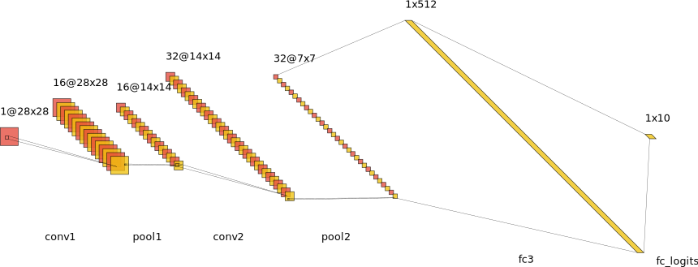

> Odredite veličine tenzora te broj parametara u svakom sloju.
Odredite veličinu receptivnog polja značajki
iz posljednjeg (drugog) konvolucijskog sloja.

Relevantan isjecak izvornog koda:

```py
net = []
inputs = np.random.randn(config['batch_size'], 1, 28, 28)
net += [layers.Convolution(inputs, 16, 5, "conv1")]
net += [layers.MaxPooling(net[-1], "pool1")]
net += [layers.ReLU(net[-1], "relu1")]
net += [layers.Convolution(net[-1], 32, 5, "conv2")]
net += [layers.MaxPooling(net[-1], "pool2")]
net += [layers.ReLU(net[-1], "relu2")]
# out = 7x7
net += [layers.Flatten(net[-1], "flatten3")]
net += [layers.FC(net[-1], 512, "fc3")]
net += [layers.ReLU(net[-1], "relu3")]
net += [layers.FC(net[-1], 10, "logits")]

loss = layers.SoftmaxCrossEntropyWithLogits()
```

Broj parametara, velicina tenzora i receptivno polje su sazeti i sljedecoj tablici:

|      sloj 	| broj parametara 	| velicina tenzora 	| receptivno polje 	|
|----------:	|:---------------:	|:----------------:	|:----------------:	|
|     slika 	|        /        	|      1x28x28     	|         1        	|
|     conv1 	|     16x1x5x5+16 	|     16x28x28     	|        5*5       	|
|     pool1 	|        /        	|     16x14x14     	|        6*6       	|
|     relu1 	|        /        	|     16x14x14     	|        6*6       	|
|     conv2 	|    32x16x5x5+32 	|     32x14x14     	|       14*14      	|
|     pool2 	|        /        	|      32x7x7      	|       16*16      	|
|     relu2 	|        /        	|      32x7x7      	|       16*16      	|
|  flatten3 	|        /        	|       1568       	|       16*16      	|
|       fc3 	|     1568x512+512	|        512       	|       28*28      	|
|     relu3 	|        /        	|        512       	|       28*28      	|
| fc_logits 	|      512x10+10  	|        10        	|       28*28      	|


Ukupan broj parametara je:
$n\_params =\\= (16*1*5*5+16) + (32*16*5*5+32) + (1568*512+512) + (512*10+10)\\ = 416 + 12832 + 803328 + 5130 \\ = 821706$
Ako je np.float32 vrsta/tip/dtype skalara koji koristimo za pamcenje pojedinacnih parametara, onda su potrebna 4 bajta po skalaru. To znaci da je za model ukupno potrebno ~3.13 MB.

> Procijenite ukupnu količinu memorije za pohranjivanje aktivacija
koje su potrebne za provođenje backpropa
ako učimo s mini-grupama od 50 slika.

Po uzoru na [zadatak koji je rijesio Sinisa](https://www.youtube.com/watch?v=BD8D5Dsx1y4&list=PLkOLgurQ4FfNPFttKlccU91yFucsQGC4y&index=16), odabrati cu relevantne aktivacije za koristenu implementaciju slojeva.

Konvolucijski slojevi kesiraju ulaz:

```py
class Convolution(Layer):
    def forward(self, x):
        # ...
        self.x_cols = im2col_cython(x, k, k, self.pad, self.stride)
        # ...
```

Zazmirit cu na to sto se zapravo kesira im2col verzija ulaza koja je vecih dimenzija.

Sloj sazimanja kesira i ulaz i izlaz:

```py
class MaxPooling(Layer):
    def forward(self, x):
        # ...
        self.x = x.reshape(N, C, H // self.pool_size, self.pool_size,
                           W // self.pool_size, self.pool_size)
        self.out = self.x.max(axis=3).max(axis=4)
        # ...
```

Flatten tehnički ne kešira ništa nista:

```py
class Flatten(Layer):
    def forward(self, inputs):
        self.input_shape = inputs.shape
        inputs_flat = inputs.reshape(self.input_shape[0], -1)
        self.shape = inputs_flat.shape
        return inputs_flat

    def backward_inputs(self, grads):
        return grads.reshape(self.input_shape)
```

Potpuno povezani sloj kesira ulaz:

```py

class FC(Layer):
    def forward(self, inputs):
        # ...
        self.inputs = inputs
        # ...
```

ReLU sloj kesira ulaz:

```py

class ReLU(Layer):
    def forward(self, inputs):
        # ...
        self.inputs = inputs
        # ...
```
U tablici ispod su isti slojevi kao u prethodnoj tablici, ali sam izdvojio stupac "velicina tenzora" i oznacio koji se tenzori keširaju. Najčešće sloj keširati prethodni sloj. Primjetite da sloj sazimanja pamti svoj izlaz i sloj relu aktivacije takodjer pamti svoj ulaz, pa tehnicki kesiraju isti tenzor, ali u implementaciji ne kopiramo tenzore pa to zauzima memoriju jedamput. Takodjer primjetite da se izlaz posljednjeg sloja tehnicki ne pamti u modelu i zato sam ga prekrizio, iako se on koristio za racunanje gradijenata gubitka.

|      sloj 	|   velicina tenzora  	|
|----------:	|:-------------------:	|
|     slika 	|       1x28x28       	|
|     conv1 	|       16x28x28      	|
|     pool1 	| **16x14x14 (dva puta, ali bez kopiranja)** 	|
|     relu1 	|       16x14x14      	|
|     conv2 	|       32x14x14      	|
|     pool2 	|  **32x7x7 (dva puta, ali bez kopiranja)**  	|
|     relu2 	|      **~~32x7x7~~**     	|
|  flatten3 	|         1568        	|
|       fc3 	|         512         	|
|     relu3 	|         512         	|
| fc_logits 	|        **~~10~~**       	|

Stoga je potrebni broj zapamcenih skalara za jednu sliku jednak sumi stupca iznad:
```py
skalara_po_slici = 1*28*28 \
    + 16*28*28 + 16*14*14 + 16*14*14 \
    + 32*14*14 + 32*7*7 \
    + 1568 + 512 + 512
print(skalara_po_slici)  # 30032
```

Potrebna kolicine memorije za jedan batch i za koristeni dtype:
```py
import numpy as np
B = 50
dtype_size = np.dtype(np.float32).itemsize
print(f"{dtype_size}B")  # 4B

activations_memory = B * dtype_size * skalara_po_slici
print(f"{activations_memory}B")  # 6006400B
print(f"~{activations_memory/1024**2:.2f}MB")  # ~5.73MB
```

### train.py - rezultati

> Napokon, pokrenite učenje modela pozivom skripte `train.py`.

Pocetak treniranja:
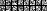

Kraj treniranja:
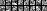

Rezultati:

```js
Train accuracy = 99.54

Validation accuracy = 99.18
Validation avg loss = 0.03

Test accuracy = 99.25
Test avg loss = 0.02
```

> Odredite vezu između početnog iznosa funkcije gubitka i broja razreda C.

Ako imamo model koji daje jednake vjerojojatnosti za sve razrede i gubitak bez regularizacije, tada bi gubitak iznosio $-1*ln(1/C) = -1*ln(0.1) = 2.303$. U pokrenutom postupku učenja, inicijalni gubitak na batchu bio je ~2.56, sto je kao $-1*ln(0.0773)$ i blizu je pukog pogadjanja.

Ocigledno je da koristimo gubitak koji uzima prosjek nad batchom. Takodjer je ocigledno da pocetni gubitak uvelike ovisi o inicijalizaciji parametara modela i da stoga moze znacajno varirati. Ponovnim pokretanjem sam primjerice dobio  2.31, sto je $-1*ln(0.0993)$ odnosno gotovo pa puko pogadjanje razreda.

## 2. zadatak (25%)

> U ovom zadatku trebate dodati podršku za L2 regularizaciju parametara. Dovršite implementaciju sloja `L2Regularizer` te naučite regularizirani model iz prethodnog zadatka koji se nalazi u `train_l2reg.py`. Proučite efekte regularizacijskog hiper-parametra tako da naučite tri različita modela s $$( \lambda = 1e^{-3}, \lambda=1e^{-2}, \lambda=1e^{-1}) $$

Relevatan isjecak implementacije:

```py

class L2Regularizer():
    # ...
    def forward(self):
        loss = self.weight_decay * (self.weights ** 2).sum()
        return loss

    def backward_params(self):
        grad_weights = 2 * self.weight_decay * self.weights
        return [[self.weights, grad_weights], self.name]
```
Prije treniranja (crveno) ---Poslije treniranja (zeleno)

$\lambda = 1e^{-3}$

```js
Train accuracy = 99.37

Validation accuracy = 99.16
Validation avg loss = 0.39

Test accuracy = 99.10
Test avg loss = 0.39
```

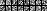
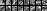

$\lambda = 1e^{-2}$

```js
Train accuracy = 98.32

Validation accuracy = 98.44
Validation avg loss = 0.18

Test accuracy = 98.52
Test avg loss = 0.18
```

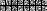
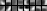

$\lambda = 1e^{-1}$

```js
Train accuracy = 94.72

Validation accuracy = 96.52
Validation avg loss = 0.56

Test accuracy = 95.08
Test avg loss = 0.58
```

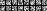
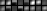

> (...) te usporedite naučene filtre u prvom sloju i dobivenu točnost.

Tablica sa svim rezultatima:

|lambda|train acc|val acc|val loss|test acc|test loss|
|-|-|-|-|-|-|
|0    | ***99.54***|***99.18***|***0.03***|***99.25***|***0.02***|
|0.001| 99.37|99.16|0.39|99.10|0.39|
|0.01 |98.32 |98.44 |0.18 |98.52 |0.18 |
|0.1  |94.72 |96.52 |0.56|95.08 |0.58 |

Iz tablice se lako primjeti da je **najvisu tocnost na skupu za testiranje postigao model bez regularizacije**, dok je model sa $\lambda=1e^{-3}$ bio blizak tom rezultatu. Povecavanjem parametra $\lambda$ je sposobnost generalizacije opadala, sto mozemo tumaciti kao prejaku regularizaciju (ili kao lose podesene ostale hiperparametre zbog kojih je model bez regularizacije bio najuspjesniji na test setu. npr stopa ucenja, broj epoha, itd. Nisam promatrao gresku kroz epohe i nisam mjerio samo sam jednom pokrenuo svaku konfiguraciju.).

"Rame uz rame" usporedba konacnih filtera za sva 4 modela je ispod (uz rastucu regularizaciju):

$\lambda: 0, 1e^{-3}, 1e^{-2}, 1e^{-1}$


Filteri bez regularizacije i uz $\lambda = 1e^{-3}$ podsjecaju na prenaucene filtere koji ne vade znacajke koje bismo ocekivali vidjeti poput feature extractora za rubove, linije, tocke, krivulje etc. Filteri za $\lambda = 1e^{-2}$ u mnogom izgledaju kao feature extractori koji mogu prepoznati rubove, liniije, zakrivljenja itd. Filteri za najjacu l2 regularizaciju $\lambda = 1e^{-1}$ izgledaju vrlo restriktivno i na njima ne prepoznajem ocekivane feature extractore.

## 3. zadatak - usporedba s PyTorchem (25%)

> U PyTorchu definirajte i naučite model koji je ekvivalentan regulariziranom modelu iz 2. zadatka. Koristite identičnu arhitekturu i parametre učenja da biste reproducirali rezultate.

✓

> Tijekom učenja vizualizirajte filtre u prvom sloju kao u prethodnoj vježbi. Nakon svake epohe učenja pohranite filtre i gubitak u datoteku (ili koristite [Tensorboard](https://pytorch.org/docs/stable/tensorboard.html)).

"Rame uz rame" usporedba konacnih filtera za sva 4 modela je ispod (uz rastucu regularizaciju):

$\lambda: 0, 1e^{-3}, 1e^{-2}, 1e^{-1}$

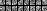
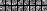
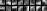
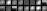

> Na kraju učenja prikažite kretanje gubitka kroz epohe (Matplotlib).

Kretanje gubitaka i tocnosti na svim skupovima (dakle i na test setu) su prikazani u nastavku. Svjestan sam da se metrike u pravilu ne mjere na test setu tokom treniranja. Ipak sam ih mjerio i uključio informativno, primjerice da mogu tvrditi da gubitci i točnost ponašaju slično tokom učenja na skupovima za validaciju i testiranje. Naime, želimo imati koresponenciju između ponašanja na skupu za validaciju i testiranje da bi na temelju skupa za validaciju moglo prosuditi o tome kada je potrebno zaustaviti učenje da bi imali dobru generalizacijsku sposobnost (o kojoj sudimo pomoću skupa za testiranje). Podatke za validaciju i testiranja nisam koristio u svrhu učenja i svjestan sam da se test set u uobičajnim postavkama ne bi trebao koristiti prije konačne evaluacije generalizacijske sposobnosti modela.

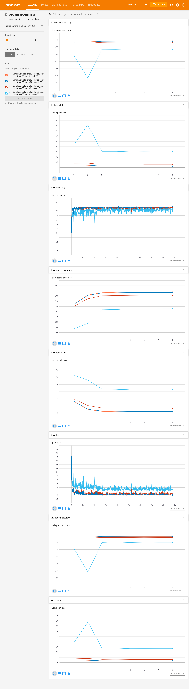

Histogrami tezina tokom epoha:

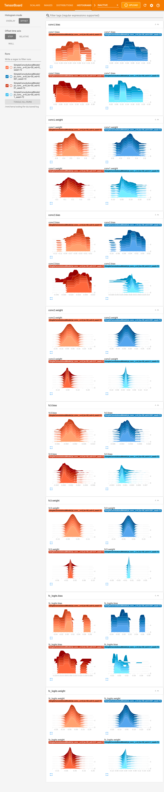

## 4. zadatak - Klasifikacija na skupu CIFAR-10 (25%)

> Najprije skinite dataset pripremljen za Python [odavde](https://www.cs.toronto.edu/~kriz/cifar-10-python.tar.gz) ili korištenjem [`torchvision.datasets.CIFAR10`](https://pytorch.org/docs/stable/torchvision/datasets.html#cifar).

✓

> Vaš zadatak je da u PyTorchu naučite konvolucijski model na ovom skupu.

✓

> Prilikom treniranja padajuću stopu učenja možete implementirati korištenjem `torch.optim.lr_scheduler.ExponentialLR`.

✓ (gamma sam stavio na $1-e^{-4}$)

> Napišite funkciju `evaluate` koja na temelju predviđenih i točnih indeksa razreda određuje pokazatelje klasifikacijske performanse:
> 1. ukupnu točnost klasifikacije
> 2. matricu zabune (engl. confusion matrix) u kojoj retci odgovaraju točnim razredima a stupci predikcijama te mjere preciznosti i odziva pojedinih razreda. U implementaciji prvo izračunajte matricu zabune, a onda sve ostale pokazatelje na temelju nje.
>
> Tijekom učenja pozivajte funkciju `evaluate` nakon svake epohe na skupu za učenje i validacijskom skupu te na grafu pratite sljedeće vrijednosti:
> 1. prosječnu vrijednost funkcije gubitka
> 2. stopu učenja
> 3. ukupnu točnost klasifikacije
>
> Preporuka je da funkciji provedete samo unaprijedni prolaz kroz dane primjere koristeći `torch.no_grad()` i pritom izračunati matricu zabune. Pazite da slučajno ne pozovete i operaciju koja provodi učenje tijekom evaluacije. Na kraju funkcije možete izračunati ostale pokazatelje te ih isprintati.

✓
(TODO dodati slike iz tensorboarda ovdje)
(TODO Confusion matrix-a dodao)

<!-- <div class="fig figcenter fighighlight">
  
  <div class="figcaption figcenter">Primjer grafa učenja za navedeni model uz veličinu grupe od 50</div>
</div> -->

> Vizualizirajte slučajno inicijalizirane težine konvolucijskog sloja možeze dohvatiti korištenjem `conv.weight`.

✓

> Prikažite 20 netočno klasificiranih slika s najvećim gubitkom te ispišite njihov točan razred, kao i 3 razreda za koje je model dao najveću vjerojatnost.

✓
(TODO dodati slike ovdje)

<!-- > Ukoliko imate GPU, možda će vam biti zanimljivo pokušati dobiti bolje rezultate s moćnijom arhitekturom. U tom slučaju [ovdje](http://rodrigob.github.io/are_we_there_yet/build/classification_datasets_results.html#43494641522d3130) možete pronaći pregled članaka koji imaju najbolje rezultate na ovom skupu. Kao što vidite trenutni *state of the art* je oko 96% ukupne točnosti. Dva važna trika koje koriste najbolje arhitekture su skaliranje slika na veću rezoluciju kako bi omogućili da prvi konvolucijski slojevi uče značajke jako niske razine te proširivanje skupa za učenje raznim modificiranjem slika (*data jittering*). Bez ovih trikova je jako teško preći preko 90% ukupne točnosti. -->

### Bonus zadatak - Multiclass hinge loss (max 20%)

Nisam rjesavao bonus. Ispod su upute.

> Ovaj zadatak razmatra učenje modela za slike iz CIFARA s alternativnom formulacijom gubitka koju nismo obradili na predavanjima. Cilj je zamijeniti unakrsnu entropiju višerazrednom inačicom gubitka zglobnice. Objašnjenje tog gubitka možete pronaći [ovdje](http://cs231n.github.io/linear-classify/#svm). Za sve bodove zadatak je potrebno riješiti primjenom osnovnih PyTorch operacija nad tenzorima te usporediti postignute rezultate.

> Pomoć: sučelje nove funkcije gubitka
moglo bi izgledati ovako:
```py
def multiclass_hinge_loss(logits: torch.Tensor, target: torch.Tensor, delta=1.):
    """
        Args:
            logits: torch.Tensor with shape (B, C), where B is batch size, and C is number of classes.
            target: torch.LongTensor with shape (B, ) representing ground truth labels.
            delta: Hyperparameter.
        Returns:
            Loss as scalar torch.Tensor.
    """
```

> Rješenje možete započeti razdvajanjem izlaza posljednjeg potpuno povezanog sloja na vektor logita točnih razreda i matricu logita netočnih razreda. To možete provesti pozivom funkcije [torch.masked_select](https://pytorch.org/docs/stable/torch.html#torch.masked_select), pri čemu masku zadajete regularnom odnosno invertiranom verzijom matrice s jednojediničnim oznakama podataka. Sada razliku između matrice logita netočnih razreda i vektora logita točnih razreda možemo izračunati običnim oduzimanjem, jer PyTorch automatski umnaža (eng. broadcast) operand nižeg reda. Pripazite da sve tenzore preoblikujete na ispravni oblik, jer funkcija `torch.masked_select` vraća tenzor prvog reda. Maksimum po elementima možete računati odgovarajućom varijantom funkcije [torch.max](https://pytorch.org/docs/stable/torch.html#torch.max).

<!--
  [torch.nn.functional.one_hot](https://pytorch.org/docs/stable/nn.functional.html#one-hot)
 -->
<!--
Pokušajte u zadnjem zadatku unakrsnu entropiju zamijeniti
višerazrednim gubitkom zglobnice te usporedite rezultate.
Objašnjenje tog gubitka možete pronaći [ovdje](http://cs231n.github.io/linear-classify/#svm).
Za sve bodove zadatak je potrebno ostvariti
primjenom osnovnih Tensorflowovih operacija nad tenzorima.

Pomoć: jedna opcija kako to možete izvesti je da razdvojite logite
(izlazi iz zadnjeg potpuno povezanog sloja) na matricu logita netočnih razreda i vektor
logita na mjestima točnih razreda.
To možete izvesti pomoću operacija `tf.dynamic_partition` i `tf.one_hot`.
Zatim unutar `tf.maximum` računate razliku
između matrice logita na netočnim razredima
i vektora logita na točnim razredima.
To možete napisati kao običnu razliku
jer za tenzore različitih dimenzija
Tensorflow po defaultu napravi *broadcasting*
ako je to moguće.
-->

<!-- <a name='add'></a> -->

### Dodatni materijali

- [Deep learning book](http://www.deeplearningbook.org/contents/convnets.html)
- [CS231n Convolutional Neural Networks for Visual Recognition](http://cs231n.github.io)
